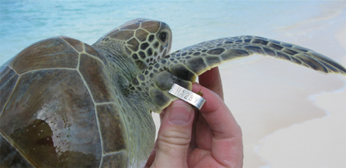
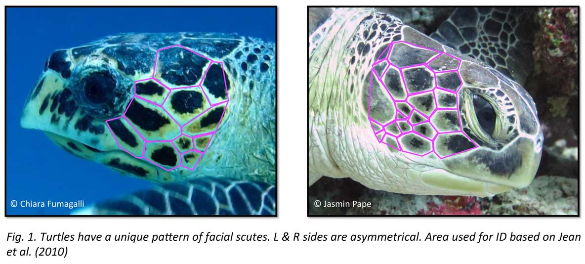
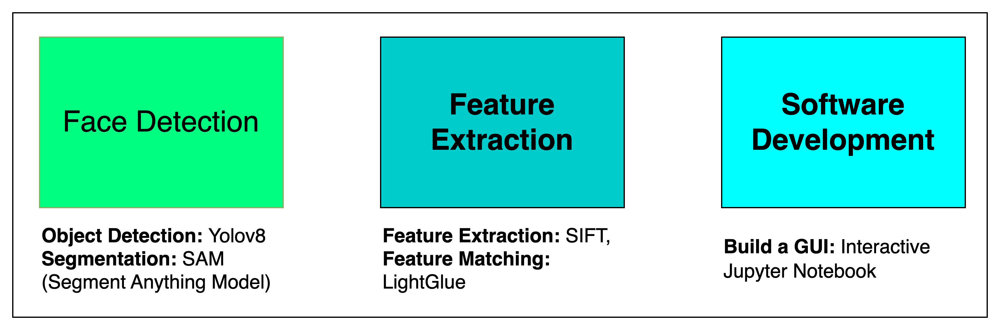
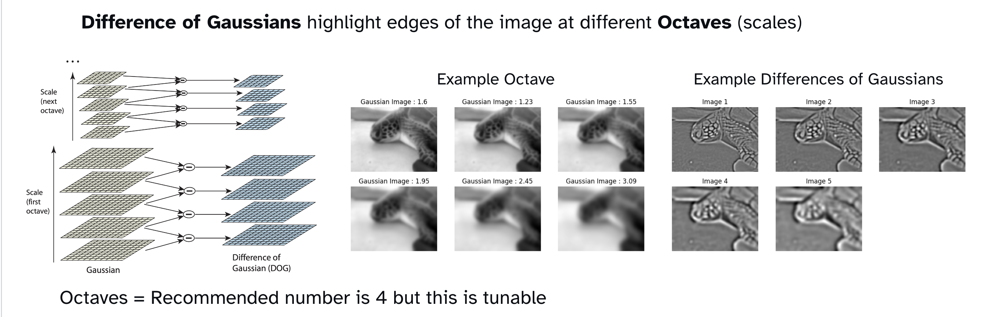
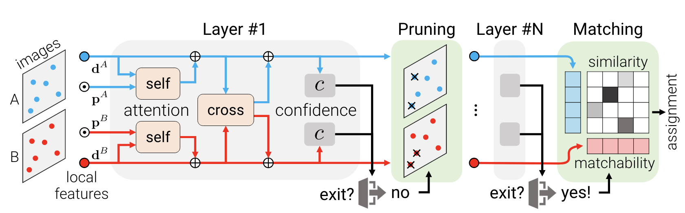
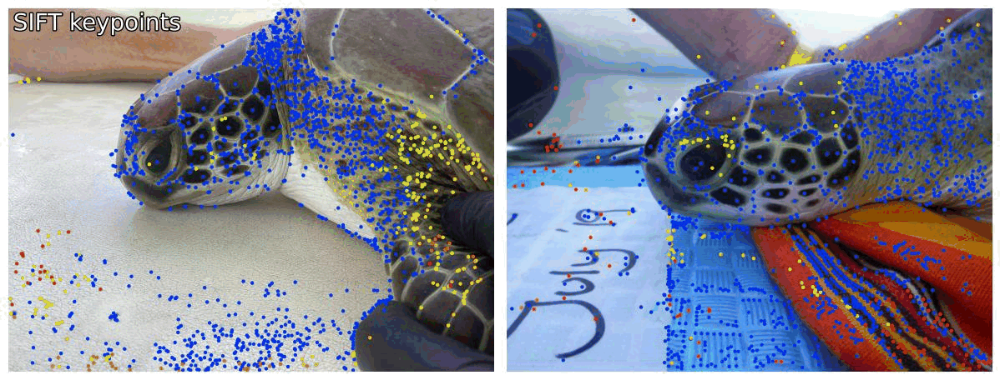
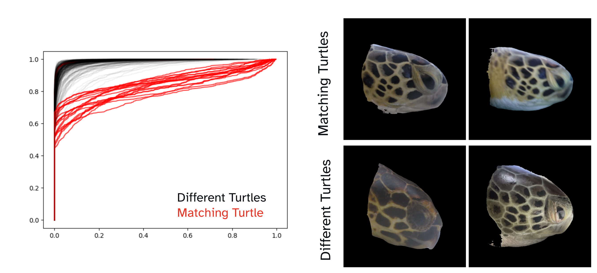

Apologies still under construction

# Facial Recognition for Sea Turtles
This demo is just a brief aspect of the Sea Turtles challenge I did with FruitPunchAI. As part of the feature extraction team I worked in a team of 3 on developing facial recognition with LightGlue
A [blog](https://www.fruitpunch.ai/blog/tracking-turtles-how-ai-helps-conservationists-to-re-identify-sea-turtles) post that describes the full project is also available on the FruitPunch website. If you just want to check out the implementation you can check out the [demo notebook](), or run the version available on [GoogleColab]()

Briefly, we found that our implementation of LightGlue with an improved evaluation metric using Wasserstein distances improved LightGlue's top5 accuracy from 77% to 92% and out competed the 2 other AI approaches ([Metric Learning](https://towardsdatascience.com/metric-learning-tips-n-tricks-2e4cfee6b75b), and [LoFTR ](https://zju3dv.github.io/loftr/))

## How to run the demo
If you want to just skip ahead feel free to run the demo [locally]() if you have a good GPU or alternatively I've created a [GoogleColab notebook]()

# Write Up
## Introduction

In order to help monitor Sea Turtle populations, conservation scientists perform capture-recapture studies which allow them to track not just numbers but also the health of the sea turtle population by assessing the health of each turtle and and comparing them to occaisons when the turtle was previously captured. But how do you know which turtle is which?

1. **Scientists can perform tagging.**

    This is essentially a small (~5cm) metal tag which is attached to the flipper of the turtle when it is first captured. When it is re-captured the name can be read. But there are several drawbacks. Firstly, the process is invasive, it causes pain to the turtle and adds even more stress to a stressful environment. Secondly, these tags can become detached overtime. This occurs either through injury, poorly attached tags, or weather conditions, etc. The rate of this occurance is fairly high meaning there is lots of data that is lost.
       
    
    
    Image taken from https://www.nationalband.com/sea-turtle-flipper-tags/

2. **Each sea turtle has a unique scale pattern on their face, and shell.**

    This is a fallback option where the scale (aka schute) patterns of the left and right sides of the face are photographed and then manually compared to a large database of >500 turtles back in the office. This is not a great solution as not only is it time consuming, it is also prone to human errors.
    
    

    Image taken from https://oliveridleyproject.org/research/biogeography/sea-turtle-photo-id/#:~:text=The%20facial%20scales%20are%20unique,Brazil%20to%20Reunion%20and%20Malaysia.

## The challenge
Our challenge at FruitPunch.ai was to help STCB by developing an automated facial recognition tool that they could use to replace both the manual comparison and the metal tagging procedure. To this end our team of 30 AI-for good volunteers were split into three teams. The facial recognition team was tasked with identifying the turtle's face, and segmenting it out to remove unnescessary information. The feature extraction team then took over, their task was to identify the key features of the image and compare these across our database of matching turtles to find the best matching turtles. Finally, the third team were tasked with building an interface that scientists with little coding experience could use effectively.

## Feature Extraction
I was placed in the feature extraction team, and myself and 3 colleagues were tasked with attempting to optimise a solution using one of the newer feature matching algorithms out there, [LightGlue](https://arxiv.org/abs/2306.13643)

### How SIFT feature detection works
SIFT (Scale-Invariant Feature Transform) detects key features in an image by detecting areas of high contrast at different scales. 

These scales are created by blurring the image with various levels of gaussian blur. Differences of Gaussian are then calculated across each of these blurred images and from these areas of high contrast are selected as key features. You can see my demo on [GoogleColab](https://colab.research.google.com/drive/1cs5z6LyGlXYbCAJ-i_HCzIwE3JueTMew) or check out Russ Islam's excellent [Medium article](https://medium.com/@russmislam/implementing-sift-in-python-a-complete-guide-part-1-306a99b50aa5).

We also evaluated several other feature detection methods such as SuperPoint, DISK, and ALIKED. But none of these proved to be as good as SIFT in the final results.

### How LightGlue works
LightGlue is essentially an improved version of [SuperGlue](https://arxiv.org/abs/1911.11763), which is a deep neural network that learns to match features across two images.

Fig 3 LightGlue Architecture, LightGlue: Local Feature Matching at Light Speed, Lindenberger et al 2023

LightGlue is most computationally efficient, more accurate, and easier to train. LightGlue primarily improves on the computational efficiency of LightGlue by dynamically adapting the network size depending on the current matching state. There are some minor tweaks to the Transformers that also improve the accuracy when compared to SuperGlue

The key output for LightGlue are tensors of points that have a matching point in the other image. For example in the .gif below thousands of potential features are extracted in both images by SIFT and then these points are compared with LightGlue, where if the best matching point is above a certain threshold the points are considered matching. Typically the greater the number of points that match between the two images the greater the similarites between the two images.

## Value added with the Wasserstein distance
### The problem with just counting points...
Using the inital metric of counting the number of matching points to identify matching turtles gave us an accuracy score of 77%. However, there were a few weaknesses that made me think this was not an acceptable metric.

* **The number of keypoints is not consistent across images**:
    
    SIFT will not always produce the same number points in every image. This means that we need to perform some normalisation (e.g. percentage of matching points) which introduces another variable to evaluate.
* **Thresholding scores throws away a lot of information**:
    
    Essentially the LightGlue output binaries the score qualities into match (1) and no match(0). This is throwing away a lot of extra information. For example if 50 points are matching at 0.8 and the threshold is set at 0.9, the match will still be scored the same as one where 50 points are scored as 0.1.
* **We should be comparing differences in distribution not the total number of points**:

    To devise a proper metric, we need to first ask the question *"What are we really interested in comparing?"*. In reality we are not comparing individual points, but rather differences in the distribution of points. In this sense instead of returning just the number of matching points, we set up LightGlue to return the score for each matching point for our first image. 

    The figure below shows the cumulative density plot of LightGlue matching scores for both matching images (Red) and non-matching images (Black). What is needed is some way of measuring how different these pairs are.

    

### Comparing distributions with the Wasserstein metric

## Public write ups/Blog posts
* [FruitPunch AI blog post](https://www.fruitpunch.ai/blog/tracking-turtles-how-ai-helps-conservationists-to-re-identify-sea-turtles)
* [Full write up on Medium with Laurens](coming soon)
