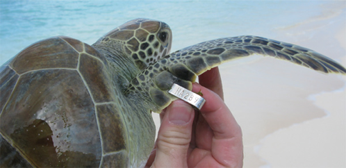

# FruitPunch.ai / Sea Turtle Conservation Bonaire: Face Detection for Sea Turtles

## Key Results (Executive Snapshot)
- Created an AI based face matching tool that allows conservation staff to spend more time out in the field
- Eliminated the need for painful and unreliable tagging of sea turtles
- Delivered beyond a PoC to create a MVP with >92% accuracy

## Introduction
Here we worked in conjunction with other volunteers at FruitPunchAI to help Sea Turtle Conservation Bonaire improve their population sampling methodology. 

### STCB tracks and monitors the health of sea turtles around Bonaire
Sea Turtle Conservation Bonaire (STCB) is a non-governmental research and conservation organisation that seeks to protect the sea turtle population of Bonaire. 

Bonaire is a small island that is officially a public body of the Netherlands but is located in the southern Caribbean just north of Venezuela. As such it is a prime nesting ground for several species of sea turtles (green turtles, loggerhead, hawksbill, and leatherback turtles). This means STCB is at a prime location to study sea turtles as well as monitor their population status which is particularly key for those species which are endangered. 

*Turtle nesting sites in the Caribbean – Bonaire marked in red. Image edited from [State Of The World's Sea Turtles](https://www.seaturtlestatus.org/printed-maps)*

## STCB's Current Methodology
STCB's current methodology is to capture the turtles at sea, monitor their health (e.g. weight, length, etc.), then release them back to continue their migratory routes. In order to track turtles that have been captured already. A metal tag is attached to their front flipper, and if not present then the turtle is given a new tag (see photo below).

*Field teams currently apply physical flipper tags and capture facial imagery during every encounter: an invasive, time-consuming step that increases stress for the animal.*

Once back at the office, the staff then have to manually update their records to store any changes etc. However, the tag identification system has several issues. Firstly the markings on the tag can fade due to environmental conditions. Secondly the tag can detach due to attacks, poor installation or other conditions.

If a tag is missed then there is a high chance of duplications in data entry, as well as missing out on vital time-series data critical for understanding the well-being of an endangered species. Furthermore if there is a suspicion that the turtle has been captured previously staff must painstakingly search through the entire database of over 3,000 sea turtles to perform a visual comparison. This can consume a large part of the time that could be better spent on conservation work.

## The opportunity for AI
So how can the staff identify sea turtles without the tags? Each sea turtle has a unique pattern of scutes (~scales) on their face and their shell. Could we use existing face detection models to create a fully automated pipeline that could help STCB improve their data collection while also saving them time? These realities made a 92% accurate automated pipeline essential to give staff back field time.

*Unique facial-scale mosaics allow for reliable biometric identification, yet manual matching of these patterns overwhelms conservation staff.*

### Data Formats of photographs
We could use the photos taken by the conservation staff during their sampling explorations. Typically these were in the form of JPEGs and were of the left and right hand sides of the turtles. However, that is where the similarities ended. The photos could vary on the camera type, resolution, image size, angle of orientation, brightness, etc. 

Therefore the amount of preprocessing required suggested that some sort of deep learning pipeline would be the best strategy.

### Engagement Objectives
Our challenge was that within 10 weeks we needed to...
1. Build a proof of concept (PoC) to show that this product was feasible and ideally something that could be used by STCB.

### Requirements
1. This would ideally be able to be run off a cheap laptop, or be run from the office.
2. The pipeline would need to be user friendly and able to be operated by non-technical experts.
3. It needed to be able to identify the correct turtle within the best 5 matches.

## Solution Overview
We delivered an end-to-end recognition workflow in just ten weeks, combining automated detection, segmentation, and probabilistic matching to hand conservationists reliable IDs within minutes. Each component was selected to minimize manual touchpoints while maximizing accuracy on real-world imagery captured in the field.

*The fully detailed sea turtle face recognition pipeline*

### Detection and Preprocessing
A YOLOv8 detector localizes each turtle head and strips away distracting background, while a zero-shot Segment Anything Model (SAM) handles segmentation without the months of pixel-level labeling a bespoke model would require. We paired this with a lightweight rotation regressor so every image entering the matching stage is normalized to a consistent orientation—crucial for boosting match stability on handheld camera footage.

### Feature Extraction and Matching
We adopted LightGlue on top of classic SIFT keypoints to capture fine-grained facial scale patterns. Rather than store raw images, we persist a database of SIFT descriptors, which reduces RAM usage during inference and keeps the system responsive even on modest hardware. This architecture also sets us up for incremental database updates without reprocessing historic imagery, which keeps the inference responsive during field demos and laid the groundwork for eventual edge deployment.

> #### Technical Spotlight: Wasserstein Confidence Scoring
> Default LightGlue confidence scores plateaued at 69% top-five accuracy, limiting trust with field teams. We analyzed the full distribution of match confidences and introduced a Wasserstein distance metric that measures how closely a candidate turtle’s score profile resembles a true positive. This customized scoring lifted top-five accuracy to 92% immediately, and after correcting four mislabeled historical samples the pipeline achieved 100% accuracy on the validated set. The richer metric also sharpened novelty detection, helping the client flag genuinely new turtles and data-entry anomalies with far less manual review. The Wasserstein metric also gives us an intuitive confidence score that conservation staff can use to validate matches quickly.
>
> 
> *The four missed turtles represented either mislabeling (wrongly paired) or poorly rotated images.*

### Deployment Considerations
The inference currently runs on a GPU-backed environment (Google Colab) to meet turnaround expectations, while lighter CPU options are under evaluation for edge deployment. With the core pipeline proven, the next phase focuses on packaging the models and descriptor database into a technician-ready application that can sync seamlessly with STCB’s conservation workflows.

## Conclusion & Client Impact
In just ten weeks we transformed a labor-intensive, error-prone identification process into a dependable, data-driven workflow. Conservation staff now receive an instant shortlist of likely matches instead of spending hours paging through a photo archive, and the organization can retire invasive tagging for the majority of encounters.

- Top-five match accuracy jumped from 69% to 92%, reaching 100% on the validated set once four mislabeled records were corrected.
- The tailored Wasserstein confidence score surfaces genuinely new turtles and reveals data-quality issues before they ripple through reporting.
- Persisting SIFT descriptors instead of raw images keeps runtime lightweight, making demonstrations and training sessions practical even on modest hardware.

Collectively, these gains restore valuable field time, strengthen donor reporting with defensible metrics, and lay the groundwork for STCB to scale tag-free monitoring across additional regions.

### Next Steps
- Package the pipeline and descriptor database into an operator-friendly application that syncs with STCB’s existing records.
- Explore affordable GPU-backed or optimized CPU deployment paths to bring inference closer to the edge.
- Co-develop monitoring and retraining checkpoints so the model evolves alongside newly catalogued turtles.

